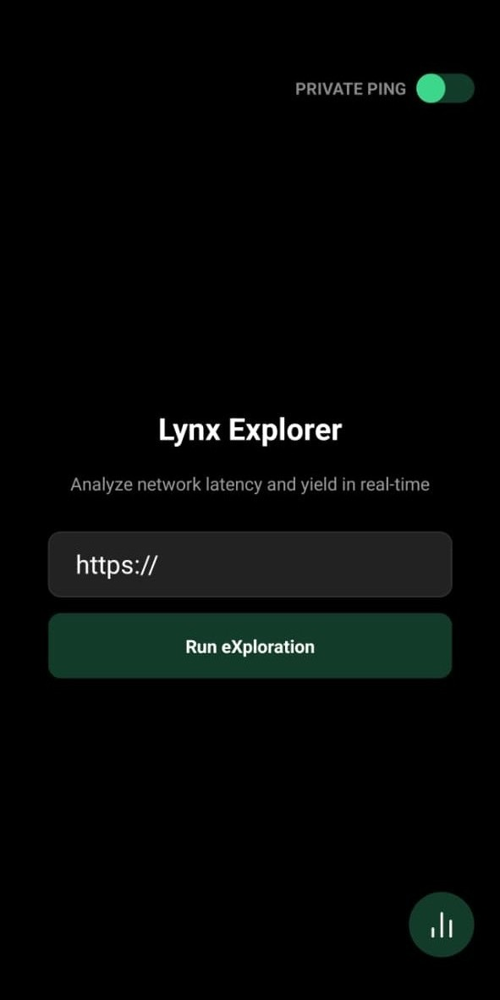
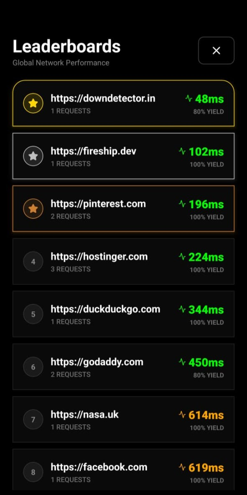

# Lynx

A modern mobile application built with **Expo + React Native** focused on a smooth and fast user experience.

---

## Screenshots




## APK Downloads

You can download and test the Android builds below.

| Version        | File                                  |
| -------------- | ------------------------------------- |
| Latest Release | [Download APK](https://github.com/ompateldeveloper/lynx/releases/download/v1.0.1-alpha/lynx.apk) |


---

## Tech Stack

* React Native
* Expo
* Expo Router
* Tamagui
* Zustand
* Zod
* React Hook Form
* Axios

---

## Features

* Modern mobile UI
* Fast navigation using Expo Router
* Secure authentication
* Form validation with Zod
* State management with Zustand

---

## Project Structure

```
app/            → Expo Router screens
components/     → Reusable UI components
assets/         → Images and icons
```

---

## Running the Project

### Install dependencies

```
npm install
```

### Start development server

```
npm run start
```

### Run on Android

```
npm run android
```

---

## Building the APK

Using EAS build:

```
npx eas build --platform android
```

Local build:

```
npx eas build --platform android --local
```

---

## Requirements

* Node 20+
* Expo CLI
* Android Studio (for local builds)

---

## Author

Om Patel

---

## License

MIT

